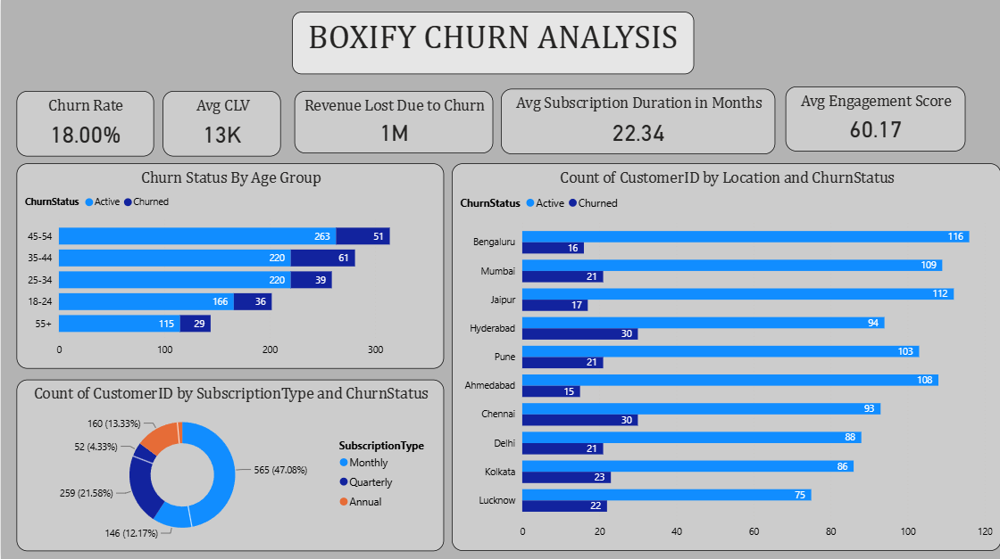
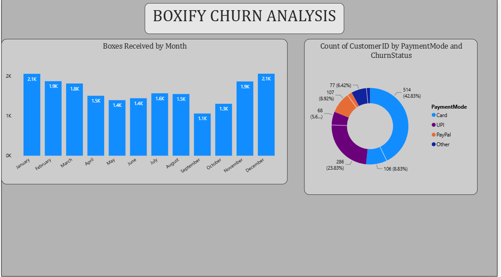

# 📊 Boxify Churn Analysis Dashboard

## Overview

The **Boxify Churn Analysis Dashboard** is a business intelligence project developed using **Power BI** to analyze customer churn patterns, subscription behavior, customer engagement, and revenue impact.

The dashboard helps stakeholders identify key factors contributing to customer churn and supports data-driven decision-making to improve customer retention and maximize revenue.

---

## Business Problem

Customer churn directly impacts revenue and business growth. Understanding:

- Which customer segments are leaving
- Which subscription plans experience higher churn
- Geographic churn patterns
- Customer engagement levels
- Revenue loss caused by churn

can help businesses develop effective retention strategies.

---

## Project Objectives

The primary objectives of this analysis are:

- Measure overall customer churn rate.
- Analyze churn across different age groups.
- Identify churn trends by location.
- Understand subscription plan preferences.
- Evaluate customer engagement levels.
- Estimate revenue lost due to churn.
- Analyze payment method usage.
- Track monthly box delivery trends.

---

## Dashboard KPIs

The dashboard highlights the following key performance indicators:

| KPI | Value |
|------|--------|
| Churn Rate | 18.00% |
| Average Customer Lifetime Value (CLV) | 13K |
| Revenue Lost Due to Churn | 1M |
| Average Subscription Duration | 22.34 Months |
| Average Engagement Score | 60.17 |

---

## Tools Used

- **Power BI Desktop**
- **Power Query**
- **DAX (Data Analysis Expressions)**
- **Microsoft Excel**
- **Data Cleaning & Transformation**

---

## Dataset Fields Used

The dataset includes information such as:

- Customer ID
- Age Group
- Location
- Subscription Type
- Churn Status
- Customer Lifetime Value (CLV)
- Subscription Duration
- Engagement Score
- Payment Mode
- Revenue
- Monthly Boxes Received

---

## Dashboard Features

### 1. Churn Analysis by Age Group
- Compares active and churned customers across age categories.
- Helps identify high-risk customer segments.

### 2. Location-wise Churn Analysis
- Displays active and churned customers across cities.
- Enables regional retention strategy planning.

### 3. Subscription Type Analysis
- Examines customer distribution across:
  - Monthly Plans
  - Quarterly Plans
  - Annual Plans
- Helps determine which plans have higher retention.

### 4. Revenue Impact Analysis
- Measures estimated revenue lost due to customer churn.

### 5. Customer Engagement Analysis
- Tracks average engagement score.
- Helps assess customer satisfaction and activity levels.

### 6. Payment Mode Analysis
- Analyzes customer payment preferences:
  - Card
  - UPI
  - PayPal
  - Other

### 7. Monthly Box Distribution Trend
- Shows monthly box delivery volume.
- Helps identify seasonal demand patterns.

---

# Dashboard Screenshots

## Main Dashboard

---

## Additional Analysis View

---

## Key Insights

### Customer Churn
- Overall churn rate stands at **18%**.
- The **35–54 age group** contributes the highest number of churned customers.

### Geographic Trends
- Hyderabad and Chennai show relatively higher churn counts compared to several other cities.
- Bengaluru has the highest active customer base.

### Subscription Behavior
- Monthly subscriptions dominate customer preferences.
- Annual plans represent a smaller share of the customer base.

### Revenue Impact
- Churn contributes to approximately **1M** in lost revenue.

### Customer Engagement
- Average engagement score of **60.17** indicates moderate customer interaction.

### Seasonal Trends
- Box deliveries peak during **January** and **December**.
- Lower activity is observed around **September and October**.

---

## Skills Demonstrated

- Data Cleaning
- Data Transformation
- Exploratory Data Analysis (EDA)
- KPI Development
- DAX Measures
- Data Visualization
- Business Insight Generation
- Customer Churn Analysis
- Dashboard Design

---

## Future Improvements

- Predictive churn modeling using Machine Learning.
- Customer segmentation analysis.
- Retention strategy recommendations.
- Interactive drill-through reports.
- Real-time dashboard integration.

---

## Author

**Rishabh Bansal**

Data Analyst

---
⭐ If you found this project useful, consider giving it a star.