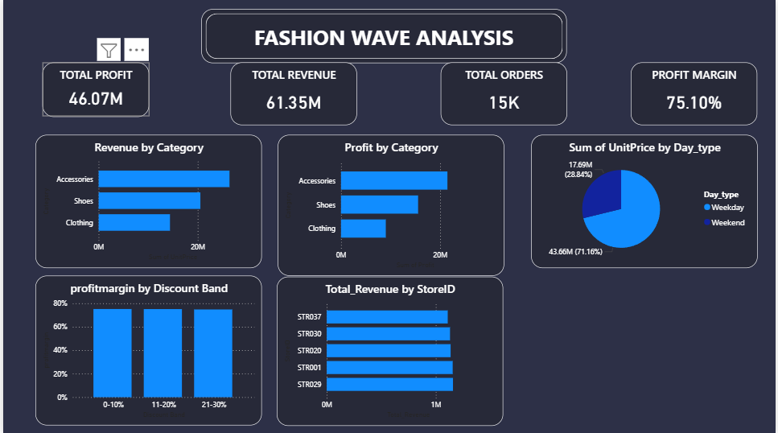
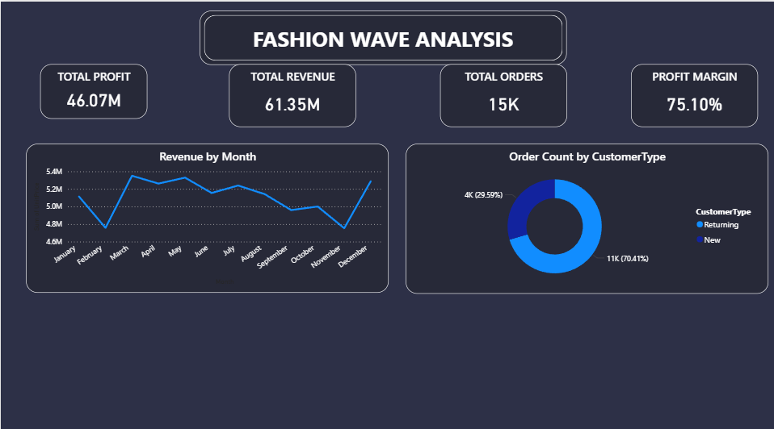

# 👗 Fashion Wave Analysis Dashboard

## 📌 Overview

The **Fashion Wave Analysis Dashboard** is a Business Intelligence project developed in **Power BI** to analyze sales performance, revenue trends, profitability, customer behavior, and store performance for a fashion retail business.

The dashboard provides a comprehensive view of key business metrics, helping stakeholders identify revenue drivers, monitor profit margins, understand customer purchasing patterns, and make data-driven decisions.

---

## 🎯 Project Objectives

- Analyze overall business performance through KPIs.
- Track revenue and profit across product categories.
- Identify top-performing stores.
- Compare weekday vs weekend sales performance.
- Understand customer segmentation (New vs Returning Customers).
- Monitor monthly revenue trends.
- Evaluate the impact of discount bands on profit margins.

---

## 🛠️ Tools & Technologies Used

| Tool | Purpose |
|--------|----------|
| Power BI | Dashboard Development & Data Visualization |
| Power Query | Data Cleaning & Transformation |
| DAX | KPI Calculations & Measures |
| Excel / CSV | Data Source |

---

## 📊 Key Business Metrics

### Dashboard KPIs

- **Total Revenue:** 61.35M
- **Total Profit:** 46.07M
- **Total Orders:** 15K
- **Profit Margin:** 75.10%

---

## 📈 Dashboard Features

### 1. Revenue Analysis
- Revenue by Category
- Monthly Revenue Trend
- Store-wise Revenue Distribution

### 2. Profit Analysis
- Profit by Product Category
- Profit Margin by Discount Band

### 3. Customer Analysis
- New vs Returning Customer Orders
- Customer Purchase Behavior Insights

### 4. Sales Pattern Analysis
- Weekday vs Weekend Sales Comparison
- Order Distribution Trends

### 5. Store Performance
- Revenue generated by each store
- Top-performing store identification

---

## 📷 Dashboard Screenshots

### Dashboard Page 1

### Dashboard Page 2

---

## 🔍 Insights Generated

### Product Performance
- Accessories generated the highest revenue and profit.
- Clothing contributed the least among all categories.

### Customer Behavior
- Returning customers accounted for approximately 70% of total orders.
- Customer retention plays a major role in business revenue.

### Sales Trends
- Revenue remained relatively stable throughout the year.
- Peaks were observed during March and December.

### Sales Timing
- Weekday sales contributed significantly more revenue than weekend sales.

### Store Analysis
- Revenue distribution across stores was fairly balanced.
- Certain stores consistently outperformed others.

---

## 📊 Business Impact

This dashboard enables management to:

- Monitor overall business performance in real-time.
- Identify high-performing products and stores.
- Improve customer retention strategies.
- Optimize discount campaigns.
- Support data-driven decision-making.

---

## 🚀 Future Improvements

- Add regional and geographical analysis.
- Implement forecasting for future sales.
- Customer Lifetime Value (CLV) analysis.
- Product-level profitability analysis.
- Interactive drill-through reports.

---

## 👨‍💻 Author

**Rishab bansal**
- Data Analyst

---

### ⭐ If you found this project useful, consider giving it a star on GitHub.