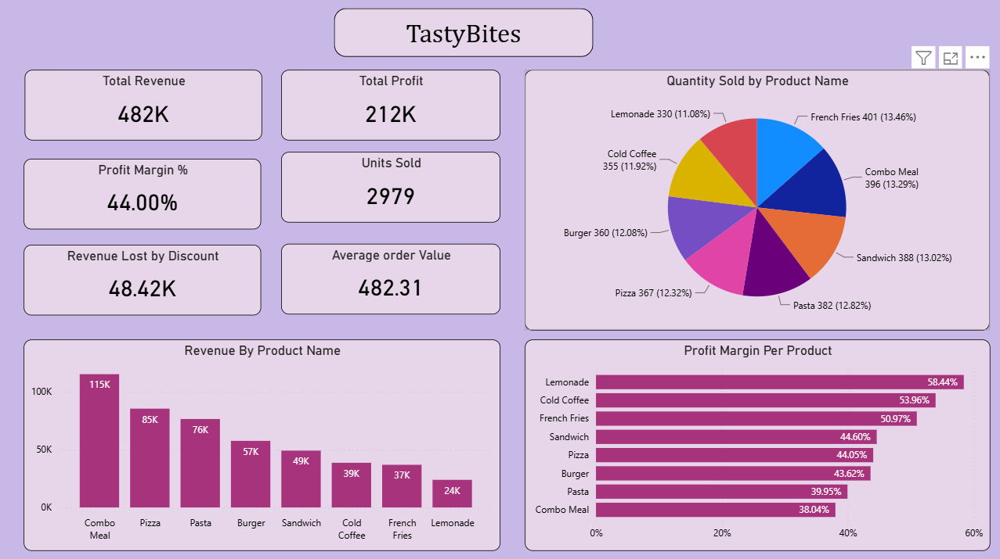
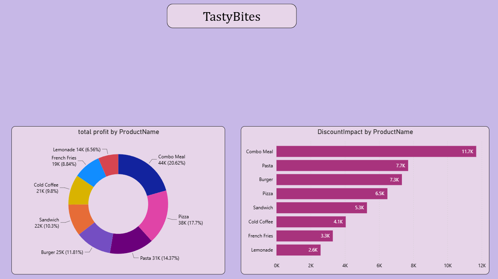

# 🍔 TastyBites Business Analysis Dashboard

## 📌 Overview

This project is a Business Analysis Case Study for **TastyBites**, a food and beverage business. The dashboard provides insights into sales performance, revenue generation, profitability, product performance, and discount impact using interactive visualizations.

The goal of this analysis is to help business stakeholders understand key performance metrics, identify top-performing products, and make data-driven decisions to improve profitability and operational efficiency.

---

## 🎯 Objectives

- Analyze overall business performance through key KPIs.
- Track revenue, profit, and profit margins.
- Identify top-selling and highest-revenue products.
- Evaluate product-wise profitability.
- Measure the impact of discounts on revenue.
- Generate actionable insights for business growth.

---

## 🛠️ Tools & Technologies Used

- **Power BI** – Dashboard Development & Data Visualization
- **Microsoft Excel** – Data Preparation & Cleaning
- **DAX (Data Analysis Expressions)** – KPI Calculations and Measures
- **Business Analysis Techniques** – Revenue, Profitability & Performance Analysis

---

---

## 📊 Key Performance Indicators (KPIs)

The dashboard tracks the following business metrics:

- Total Revenue
- Total Profit
- Profit Margin %
- Units Sold
- Average Order Value
- Revenue Lost Due to Discounts

---

## ✨ Dashboard Features

### 1. Executive KPI Summary
Provides a quick overview of business performance through KPI cards:
- Total Revenue
- Total Profit
- Profit Margin
- Units Sold
- Average Order Value
- Revenue Lost by Discount

### 2. Revenue Analysis
- Product-wise revenue comparison
- Identification of top revenue-generating products

### 3. Sales Distribution Analysis
- Quantity sold by product category
- Product contribution to total sales volume

### 4. Profitability Analysis
- Product-wise profit margin comparison
- Most and least profitable products

### 5. Discount Impact Analysis
- Revenue loss caused by discounts
- Products most affected by discount strategies

### 6. Profit Contribution Analysis
- Product contribution to total profit
- Identification of high-profit products

---

## 📈 Business Insights

### Revenue Performance
- **Combo Meal** generated the highest revenue.
- **Pizza** and **Pasta** were strong contributors to overall sales.

### Profitability
- **Lemonade** achieved the highest profit margin.
- **Combo Meal** generated the highest total profit despite a lower margin percentage.

### Discount Impact
- Discounts had the highest impact on **Combo Meals**.
- Optimizing discount strategies could improve overall profitability.

### Sales Distribution
- Sales quantity is relatively balanced across products.
- No single product dominates overall unit sales.

---

# 📷 Dashboard Screenshots

## Main Dashboard

---

## Profit & Discount Analysis Dashboard

---

## 📋 Conclusion

The TastyBites Business Analysis Dashboard provides a comprehensive view of business performance by combining revenue, profit, sales volume, and discount impact analysis into a single reporting solution.

This dashboard enables stakeholders to:
- Monitor business KPIs efficiently.
- Identify profitable products.
- Optimize discount strategies.
- Make informed business decisions using data-driven insights.

---

## 👨‍💻 Author

**Rishab  Bansal**
Data Analyst

---
⭐ If you found this project useful, consider giving it a star.
