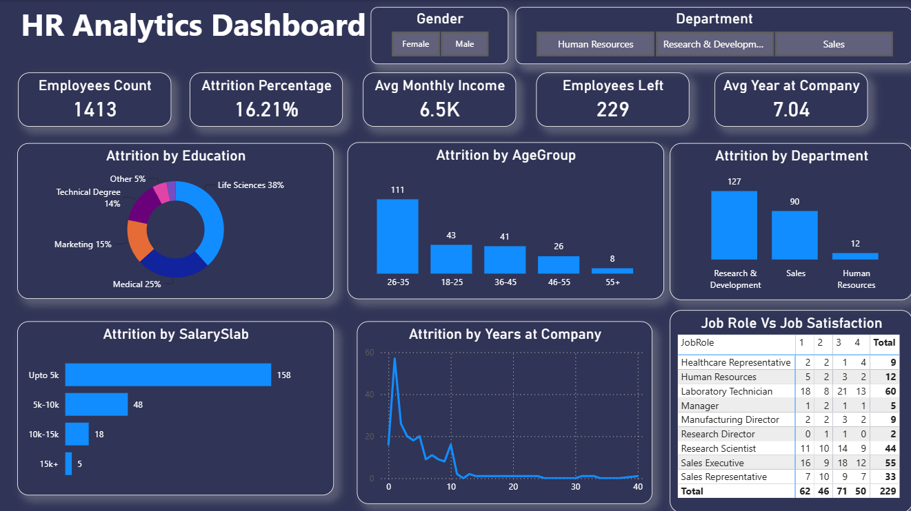

# 👥 HR Analytics Dashboard

## 📌 Overview

This HR Analytics Dashboard provides a comprehensive analysis of employee attrition, workforce demographics, salary distribution, job satisfaction, and departmental trends. The dashboard helps HR teams and business leaders identify the factors contributing to employee turnover and make data-driven decisions to improve employee retention.

The analysis focuses on understanding workforce behavior, attrition patterns, and organizational performance through interactive visualizations and key HR metrics.

---

## 🎯 Objectives

- Monitor overall workforce statistics.
- Analyze employee attrition trends.
- Identify departments with high turnover rates.
- Understand the relationship between salary, tenure, and attrition.
- Evaluate employee satisfaction across job roles.
- Support HR decision-making with actionable insights.

---

## 🛠️ Tools & Technologies Used

- **Power BI** – Dashboard Development & Data Visualization
- **Microsoft Excel** – Data Cleaning & Data Preparation
- **DAX (Data Analysis Expressions)** – KPI Calculations and Measures
- **HR Analytics Techniques** – Employee Retention & Attrition Analysis

---

## 📊 Key Performance Indicators (KPIs)

The dashboard tracks the following HR metrics:

- Total Employees
- Attrition Percentage
- Average Monthly Income
- Employees Left
- Average Years at Company

---

## ✨ Dashboard Features

### 1. Workforce Overview
Provides a snapshot of the organization's workforce:
- Total Employee Count
- Attrition Rate
- Average Monthly Salary
- Employee Turnover
- Average Employee Tenure

### 2. Attrition Analysis by Education
- Employee attrition categorized by education background.
- Identifies educational groups with higher turnover.

### 3. Attrition Analysis by Age Group
- Compares attrition across different age categories.
- Highlights the most vulnerable employee age segments.

### 4. Department-wise Attrition
- Tracks employee turnover across departments.
- Identifies departments with retention challenges.

### 5. Salary-Based Attrition Analysis
- Evaluates turnover patterns based on salary ranges.
- Helps determine whether compensation impacts retention.

### 6. Attrition by Years at Company
- Examines employee exits based on tenure.
- Identifies critical periods when employees are most likely to leave.

### 7. Job Satisfaction Analysis
- Compares job satisfaction levels across different job roles.
- Helps understand employee engagement and workplace satisfaction.

### 8. Interactive Filtering
Users can dynamically filter data by:
- Gender
- Department

---

## 📈 Key Insights

### Employee Attrition
- Overall attrition rate stands at **16.21%**.
- A total of **229 employees** have left the organization.

### Department Analysis
- **Research & Development** experienced the highest employee attrition.
- **Human Resources** recorded the lowest attrition levels.

### Age Group Analysis
- Employees aged **26–35 years** showed the highest turnover.
- Attrition decreases significantly among older age groups.

### Salary Analysis
- Most employee exits occurred in the **Up to 5K salary range**.
- Attrition reduces as salary levels increase.

### Education Analysis
- Employees from **Life Sciences** backgrounds contributed the largest share of attrition.
- Medical and Marketing fields also showed notable turnover.

### Employee Tenure
- Attrition is highest during the initial years of employment.
- Long-tenured employees show significantly lower exit rates.

### Job Satisfaction
- Satisfaction levels vary considerably across job roles.
- Certain operational and sales roles exhibit higher attrition alongside moderate satisfaction scores.

---

# 📷 Dashboard Screenshot

---

## 📋 Business Value

This dashboard enables HR teams to:

- Identify key attrition drivers.
- Improve employee retention strategies.
- Monitor workforce health in real time.
- Analyze compensation-related turnover.
- Support strategic workforce planning.
- Enhance employee engagement initiatives.

---

## 🚀 Skills Demonstrated

- HR Analytics
- Data Cleaning
- Data Modeling
- DAX Calculations
- KPI Development
- Data Visualization
- Workforce Analysis
- Attrition Analysis
- Business Intelligence Reporting
- Power BI Dashboard Design

---

## 👨‍💻 Author

**Rishab Bansal**
Data Analyst

---

⭐ If you found this project useful, consider giving it a star.