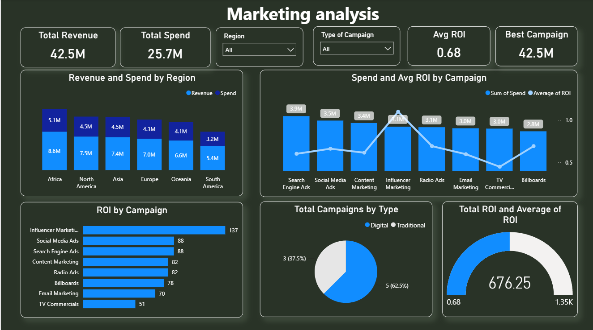

# 📈 Marketing Analysis Dashboard

## 📌 Overview

This Marketing Analysis Dashboard provides a comprehensive view of campaign performance, marketing spend, revenue generation, and return on investment (ROI). The dashboard enables marketing teams and business stakeholders to evaluate campaign effectiveness, optimize budget allocation, and maximize revenue through data-driven decision-making.

The analysis compares campaign performance across different marketing channels, regions, and campaign types to identify the most profitable marketing strategies.

---

## 🎯 Objectives

- Monitor overall marketing performance.
- Analyze revenue generated from marketing campaigns.
- Track marketing spend across channels and regions.
- Measure campaign ROI and effectiveness.
- Compare digital and traditional marketing performance.
- Identify high-performing campaigns for future investment.

---

## 🛠️ Tools & Technologies Used

- **Power BI** – Dashboard Development & Data Visualization
- **Microsoft Excel** – Data Cleaning & Preparation
- **DAX (Data Analysis Expressions)** – KPI Measures and Calculations
- **Marketing Analytics Techniques** – ROI & Campaign Performance Analysis

---

## 📊 Key Performance Indicators (KPIs)

The dashboard monitors the following marketing metrics:

- Total Revenue
- Total Marketing Spend
- Average ROI
- Best Performing Campaign Revenue
- Revenue by Region
- Campaign Performance Metrics

---

## ✨ Dashboard Features

### 1. Marketing Performance Overview
Provides a snapshot of key marketing metrics:
- Total Revenue
- Total Spend
- Average ROI
- Best Campaign Performance

### 2. Regional Performance Analysis
- Revenue generated by region
- Marketing spend by region
- Regional profitability comparison

### 3. Campaign ROI Analysis
- ROI comparison across marketing channels
- Identification of the highest-performing campaigns
- Campaign effectiveness measurement

### 4. Spend vs ROI Comparison
- Analysis of marketing budget allocation
- Relationship between campaign spend and returns
- Budget optimization insights

### 5. Campaign Type Distribution
- Comparison between Digital and Traditional campaigns
- Campaign count by marketing type

### 6. Interactive Filtering
Users can filter data by:
- Region
- Campaign Type

---

## 📈 Key Insights

### Revenue Performance
- Total Revenue generated reached **42.5M**.
- Total Marketing Spend amounted to **25.7M**.

### Regional Analysis
- **Africa** generated the highest revenue contribution.
- **South America** contributed the lowest revenue among regions analyzed.

### Campaign Performance
- **Influencer Marketing** delivered the highest ROI.
- **Social Media Ads** and **Search Engine Ads** also produced strong returns.

### Budget Efficiency
- Several campaigns generated high ROI despite moderate spending levels.
- Campaign effectiveness varies significantly across channels.

### Marketing Mix
- Digital campaigns represented the majority of marketing activities.
- Traditional campaigns contributed a smaller share of total campaigns.

### ROI Insights
- Overall Average ROI stands at **0.68**.
- High-performing campaigns indicate opportunities for scaling successful strategies.

---

# 📷 Dashboard Screenshot

---

## 📋 Business Value

This dashboard helps organizations:

- Optimize marketing budget allocation.
- Identify top-performing marketing channels.
- Improve campaign planning and execution.
- Measure campaign effectiveness using ROI.
- Compare regional marketing performance.
- Support data-driven marketing decisions.

---

## 🚀 Skills Demonstrated

- Marketing Analytics
- Data Cleaning
- Data Modeling
- KPI Development
- DAX Calculations
- Power BI Dashboard Design
- ROI Analysis
- Campaign Performance Analysis
- Data Visualization
- Business Intelligence Reporting

---

## 👨‍💻 Author

**Rishabh Bansal**

Data Analyst

---

⭐ If you found this project useful, consider giving it a star.