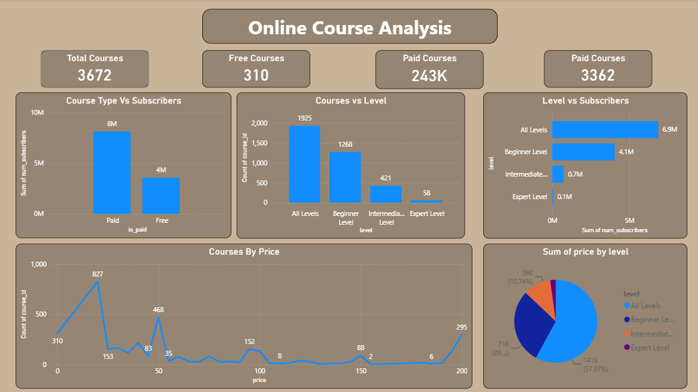
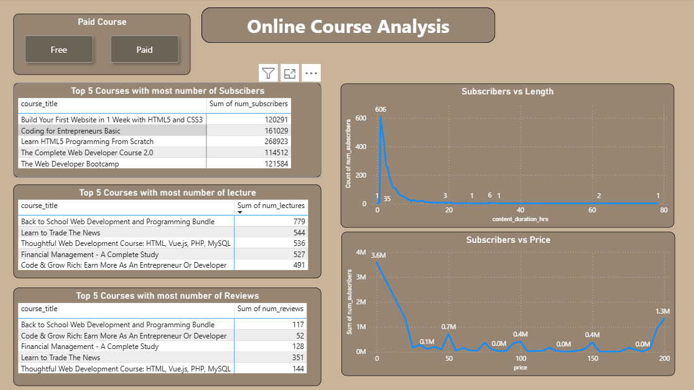

# 📚 Online Course Analysis Dashboard | Power BI

## 📌 Project Overview

This project presents an interactive **Power BI Dashboard** built using an online course dataset (Udemy Courses). The dashboard analyzes course performance based on pricing, subscribers, course level, duration, lectures, and reviews to help identify learning trends and business opportunities.

The dashboard enables users to compare **Free vs Paid courses**, analyze subscriber behavior, identify the most popular courses, and understand how pricing influences enrollments.

---

## 🎯 Objectives

- Analyze overall course distribution.
- Compare Free and Paid course performance.
- Identify the most popular courses.
- Understand subscriber trends across different levels.
- Analyze the relationship between price, duration, and subscribers.
- Generate actionable business insights.

---

## 🛠️ Tools Used

- **Power BI**
- Power Query
- DAX
- Data Modeling
- Data Visualization

---

## 📂 Dataset Information

The dataset contains information about online courses, including:

- Course Title
- Course Price
- Number of Subscribers
- Number of Reviews
- Number of Lectures
- Course Duration
- Course Level
- Course Type (Free/Paid)

---

# 📊 Dashboard 1 - Overall Analysis

### KPI Cards

- Total Courses
- Free Courses
- Paid Courses
- Total Paid Course Revenue

### Visualizations

- Course Type vs Subscribers
- Courses by Level
- Level vs Subscribers
- Courses by Price
- Price Distribution by Course Level

---

# 📊 Dashboard 2 - Detailed Analysis

### Filters

- Free Courses
- Paid Courses

### Visualizations

- Top 5 Courses by Subscribers
- Top 5 Courses by Lectures
- Top 5 Courses by Reviews
- Subscribers vs Course Duration
- Subscribers vs Price

---

# 📈 Key Insights

### 1. Paid Courses Dominate Subscriber Base

- Paid courses generated approximately **8 million subscribers**, while free courses attracted around **4 million subscribers**.
- Paid content continues to drive significantly higher engagement despite fewer free offerings.

---

### 2. Most Courses are Beginner Friendly

- Beginner-level courses account for the majority of the catalog.
- Expert-level courses represent only a small percentage, indicating limited advanced learning options.

---

### 3. Beginners Generate the Highest Demand

- Beginner courses attract over **4 million subscribers**.
- Demand decreases significantly for Intermediate and Expert-level courses.

---

### 4. Large Number of Courses are Low-Priced

- Most courses are concentrated within lower price ranges.
- Course availability declines as price increases.

---

### 5. Premium Courses Still Attract Learners

- Although expensive courses are fewer, several premium-priced courses still maintain strong subscriber counts.
- High-value content can successfully compete despite higher pricing.

---

### 6. Subscriber Growth Declines with Longer Course Duration

- Short-duration courses receive the highest number of enrollments.
- Longer courses generally experience lower subscriber counts.

---

### 7. Highly Rated Courses are Not Always the Most Subscribed

- Courses with the highest review counts differ from those with the highest subscriber counts.
- Course quality and learner engagement do not always translate directly into enrollment volume.

---

### 8. Web Development Dominates Popular Courses

The most subscribed courses are primarily focused on:

- HTML
- CSS
- JavaScript
- Web Development
- Programming Fundamentals

This highlights strong market demand for web development skills.

---

## 📌 Dashboard Features

- Interactive slicers
- Dynamic KPI cards
- Drill-down analysis
- Cross-filtering visuals
- Responsive dashboard layout
- Business-oriented insights

---

## 📷 Dashboard Preview

### Dashboard 1

### Dashboard 2

---

## 🚀 Project Outcome

This dashboard provides a comprehensive view of online course performance by combining subscriber behavior, pricing analysis, course levels, reviews, and content characteristics. It enables stakeholders to make informed decisions regarding pricing strategy, course development, marketing priorities, and learner engagement.

---

## 👤 Author

**Rishab Bansal**

- 💼 Aspiring Data Analyst
- 🛠️ Skills: Power BI, SQL, Python, Excel, Tableau
- 📧 Email: *Your Email*
- 🔗 LinkedIn: *Your LinkedIn Profile*
- 💻 GitHub: *Your GitHub Profile*
